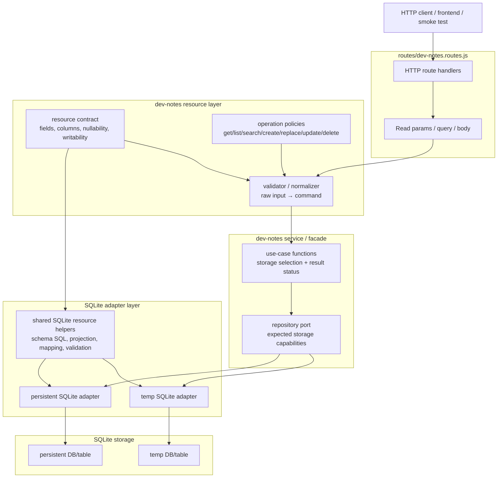
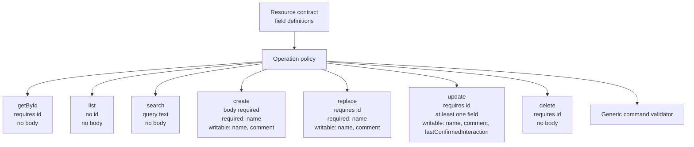
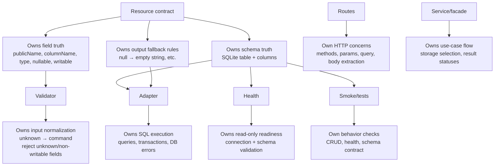
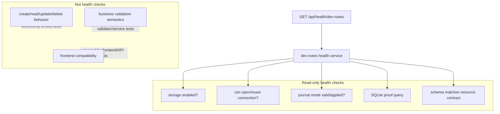

# Dev-notes M1 Backend Target

Dev-notes is a disposable M1 backend resource used to prove CRUD, health reporting, validation,
storage boundaries and frontend/backend interaction patterns.

It is not the final medication-domain model.

## Goals

- Provide a clear backend CRUD/resource proving ground.
- Keep HTTP, validation, service, repository, adapter and storage concerns separated.
- Define dev-note field/schema truth once through a resource contract.
- Use tests to validate API behavior without turning health checks into behavior tests.
- Keep health checks read-only and dependency-focused.

## High-level dev-notes boundary diagram



<details>

<summary>Core meaning</summary>

- Routes do HTTP.
- Validator turns unknown input into commands.
- Service/facade does use-case orchestration.
- Adapters do storage.
- Resource contract owns field truth.
- Shared SQLite helpers derive mechanical SQL/schema/mapping.

</details>

## Request → command → row → response flow

```mermaid
flowchart LR
  Raw["Raw HTTP input\nparams/query/body\nRecord<string, unknown>"]

  Command["Normalized command\nid + values + providedFields"]

  Service["Use-case result\ncreated / updated / deleted / not-found / invalid-request"]

  Repo["Repository call\nstorage operation"]

  Row["SQLite row\ncolumn names / nullable DB values"]

  Resource["Public API resource\nstable filled object"]

  Json["JSON response"]

  Raw -->|"validator + operation policy"| Command
  Command -->|"facade/service"| Service
  Service -->|"repository port"| Repo
  Repo -->|"SQL adapter"| Row
  Row -->|"mapper + output fallback"| Resource
  Resource -->|"route returnCodes"| Json
```



<details>

<summary>Important rule this captures</summary>

- Raw input is flexible.
- Command is normalized.
- DB row may contain nulls.
- Returned API resource is stable and filled.

So eg `comment` may be stored as `NULL`, but the API returns:

```json
{
  "comment": ""
}
```

</details>

## Operation policy diagram



<details>

<summary>Key abstraction</summary>

This is the key abstraction: the validator does not need hardcoded
name/comment/lastConfirmedInteraction logic. It gets allowed fields from the operation policy and
field rules from the contract.

</details>

## Ownership diagram



<details>

<summary>Rule</summary>

- No layer invents field truth.
- They either consume the contract or handle their own boundary concern.

</details>

## Health boundary diagram



<details>

<summary>Health rule</summary>

- Health is read-only.
- Health validates dependency readiness.
- CRUD smoke validates behavior.

</details>

## Data shapes

- raw HTTP input
- normalized command
- repository input
- SQLite row
- public API resource

## Resource contract ownership

one place owns fields, column names, writability, nullability, output fallback

## What can be generic

- schema generation
- schema validation
- row mapping
- select aliases
- basic command validation
- safe dynamic PATCH SET clauses

## What stays explicit

- route semantics
- operation statuses
- storage selection
- search behavior
- timestamp behavior
- health summary policy

## Health model

- health is read-only
- health validates connection + schema
- CRUD smoke validates behavior
- health does not create/delete rows intentionally except normal DB init

## Test model

- schema contract test
- CRUD API smoke
- health smoke
