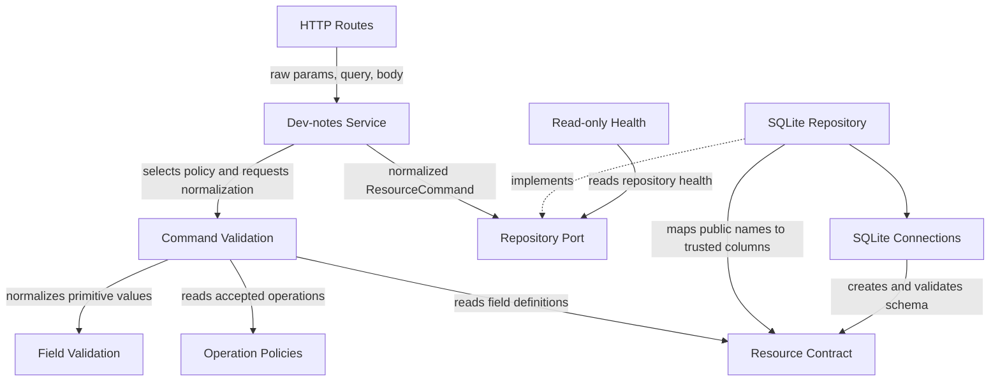

# Dev-notes boundary relationships

This document is the compact navigation map for `dev-notes-new`. The architecture target explains
why the module exists; this file explains how its concrete pieces are allowed to depend on each
other.

## Intended dependency flow



The generated import graph may contain more helper nodes, but it should remain a detailed expansion
of this shape. Backward dependencies or shortcuts across layers require an explicit reason.

## Field identities

Each resource field has three identities with different owners and consumers.

| Identity | Example | Purpose |
| --- | --- | --- |
| Contract key | `lastConfirmedInteraction` | Internal structural lookup in `resource.fields` and operation policies |
| `publicName` | `lastConfirmedInteraction` | JavaScript/API property used in raw input, commands, repository values and responses |
| `columnName` | `last_confirmed_interaction` | Trusted SQLite identifier used only after lookup through the contract |

The values currently happen to match for several contract keys and public names. Code must not rely
on that coincidence.

Operation-policy field arrays contain **contract keys**. Validation looks up each definition and then
reads or reports the definition's **public name**. Repository commands contain public-name values;
SQLite helpers translate those values to trusted column names through the contract.

## Boundary ownership

- `routes.js` owns Express request extraction and HTTP status translation.
- `validation/command-validation.js` owns raw request-to-command orchestration.
- `validation/field-validation.js` owns primitive value normalization and structured problems.
- `resource/contract.js` owns stable field and storage identity.
- `resource/operations.js` owns operation-specific accepted, required and system field keys.
- `service/` owns use-case orchestration, storage selection and stable operation results.
- `repository/repository-port.js` defines the capabilities the service is allowed to call.
- `adapters/sqlite/` owns SQL generation, execution, schema validation and row mapping.
- `health/` owns feature/storage health aggregation and remains read-only apart from normal schema
  initialization performed by a connection.
- `index.js` is the composition root. It may know concrete implementations; lower layers may not
  import it.

## Worked PATCH trace

For `PATCH /dev-notes/temp/12` with:

```json
{
  "lastConfirmedInteraction": "2026-07-25T12:00:00.000Z"
}
```

1. The route passes storage `temp`, id `12`, the raw body and raw query to the service.
2. The service selects the `update` operation policy.
3. Command validation reads the policy contract key `lastConfirmedInteraction`.
4. The field definition supplies public name `lastConfirmedInteraction`, type `string`, nullability
   and empty-string policy.
5. Validation returns a command with id `12`, public-name values and public-name
   `providedFields`.
6. The service calls `repository.update(12, values, providedFields)` through the port.
7. The SQLite repository resolves the public name through the resource contract and generates an
   assignment for trusted column `last_confirmed_interaction`.
8. The returned SQLite row is aliased back to public names and null output fallbacks are applied.
9. The route converts the service result status `updated` to HTTP 200.

## Review rule

When a parameter, import or helper cannot be explained by this map, do not remove or extend it based
only on local appearance. First decide which boundary owns the information and document the reason.
