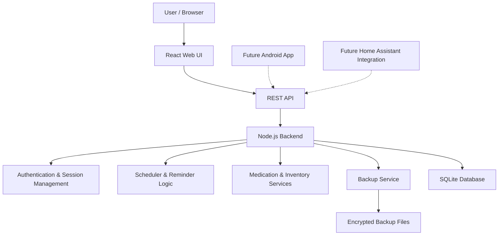
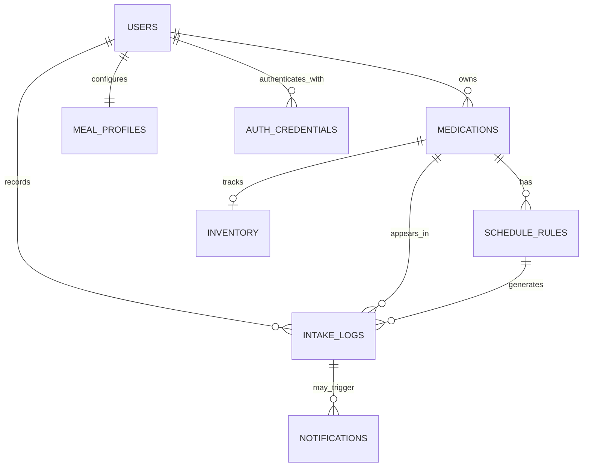
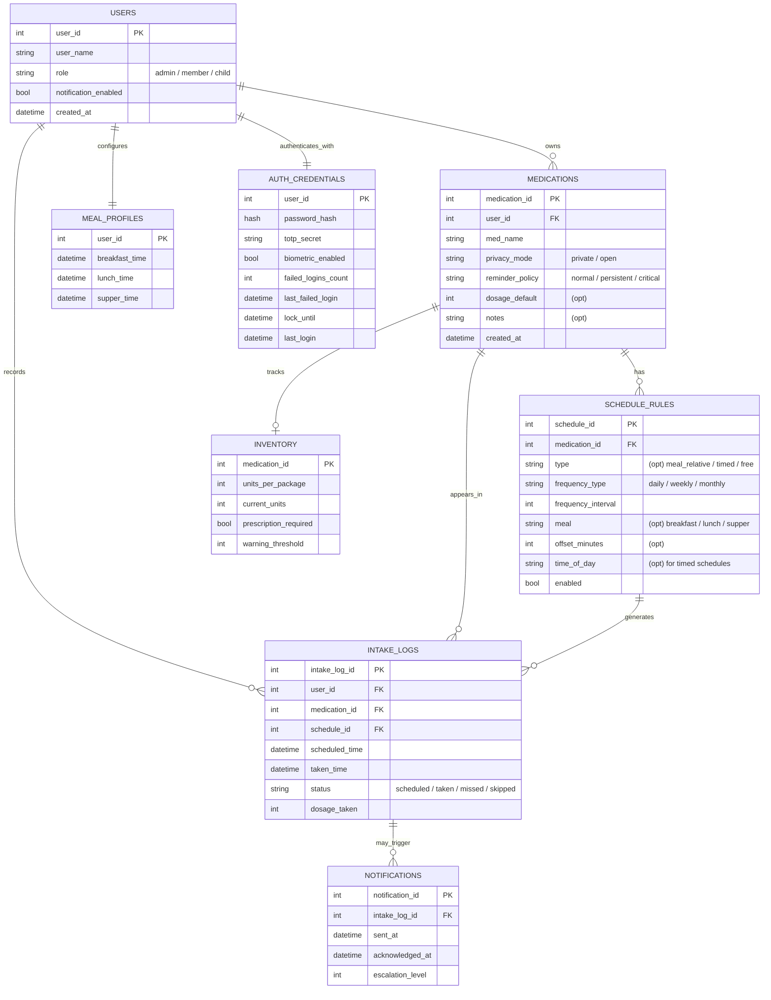
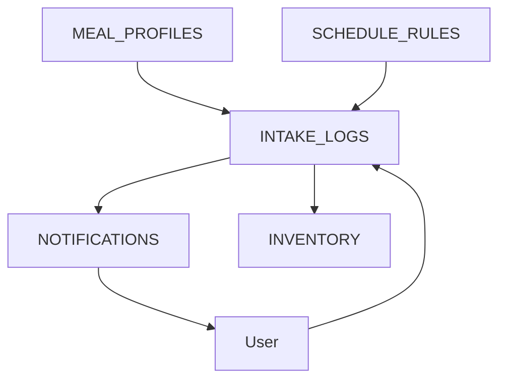

# Software Design Document

## System architecture

<!--
A high-level diagram of the architecture
Description of major components and what they do
Explanation of design patterns and architectural styles used
Discussion of important design decisions and trade-offs
-->

#### Frontend (React-based)

- Render application state received from the backend
- Provide medication, schedule and inventory management screens
- Provide daily intake overview
- Allow users to acknowledge or skip reminders
- Display privacy-aware browser / UI notifications
- Validate user input for usability purposes

The frontend must not be treated as trusted. All relevant authorization and business rules are enforced by the backend.

#### Backend (Node.js exposing a REST API)

- Own all business logic
- Validate API requests
- Manage authentication and sessions
- Manage medications, schedules, inventory and intake history
- Generate daily reminder / intake states
- Trigger reminder escalation behavior
- Handle backup creation and restore workflows
- Communicate with the SQLite database

The backend is the source of truth for application state.

#### Database / local persistence layer (SQLite)

- Store users
- Store medication definitions
- Store schedule rules
- Store inventory state
- Store intake history
- Store backup metadata if required

Clients never access SQLite directly. All access goes through the backend.

#### Backups

- Handled by the backend
- Create encrypted database backups
- Create encrypted configuration backups if required
- Store backups in a mounted backup directory
- Allow restore workflows through the web interface in the future

Backup encryption keys must not be stored inside the backup directory.

#### Authentication

MVP authentication uses single-user login with server-managed sessions.

Sessions are stored server-side and transmitted via secure cookies when HTTPS is available.

Future authentication extensions may include TOTP and Android biometric unlock. Biometric unlock is treated as a client-side convenience and does not replace backend session authentication.

---

## Data design

<!--
Database structure and table layouts
Data flow diagrams
Data validation and integrity rules
How data will be stored and retrieved
-->

Condensed:

Extensive:

This user story demonstrates how the data model interacts during a typical medication intake workflow.

User Story: Daily Vitamin D intake

### Scenario

The user has configured Vitamin D (`MEDICATIONS:med_name`) to be taken every day (`SCHEDULE_RULES:frequency_type`) 15 minutes before (`SCHEDULE_RULES:offset_minutes`) breakfast (`SCHEDULE_RULES:meal`).

Breakfast is configured for 08:00 (`MEAL_PROFILES:breakfast_time`), resulting in a scheduled intake time of 07:45.

The medication uses the 'normal' reminder policy (`MEDICATIONS:reminder_policy`).

### Expected Flow

1. The scheduler generates the next intake event from the meal profile and schedule rule.
2. An intake log entry is generated for 07:45 (`INTAKE_LOGS:scheduled_time`).
3. A browser notification is sent (`NOTIFICATIONS`).
4. The user marks the medication as taken.
5. The intake log is updated and the notification is acknowledged (`NOTIFICATIONS:acknowledged_at && INTAKE_LOGS:taken_time`).
6. Inventory is decremented by one tablet (`INVENTORY:current_units`).

### Data Flow

### Database State

Before:

- `INVENTORY.current_units = 42`
- `INTAKE_LOGS.status = scheduled`

After:

- `INVENTORY.current_units = 41`
- `INTAKE_LOGS.status = taken`
- `NOTIFICATIONS.acknowledged_at != null`
- `INTAKE_LOGS.taken_time != null`

---

## Interface design

<!--
API specifications and protocols
Message formats and data structures
How errors and exceptions will be handled
Security and authentication methods
-->

---

## Component design

<!--
Purpose and responsibilities
Input and output specifications
Algorithms and processing logic
Dependencies on other components or external systems
-->

---

## User interface design

<!--
Wireframes or mockups of key screens
Description of user workflows and interactions
Accessibility considerations
-->

---

## Assumptions and dependencies

<!--
Technical assumptions about the development environment
Dependencies on external libraries or services
Constraints related to hardware, software, or infrastructure
Any regulatory or compliance requirements
-->
