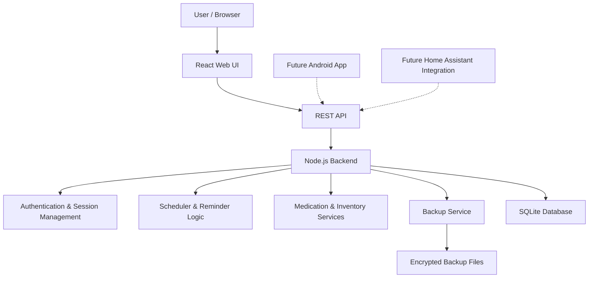
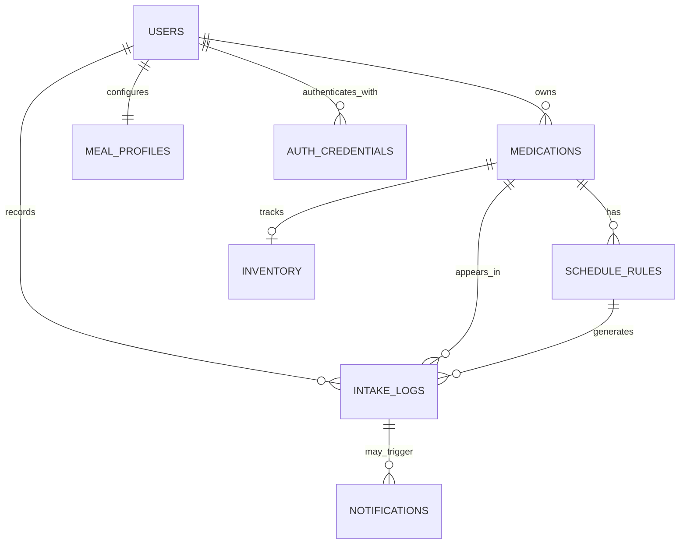
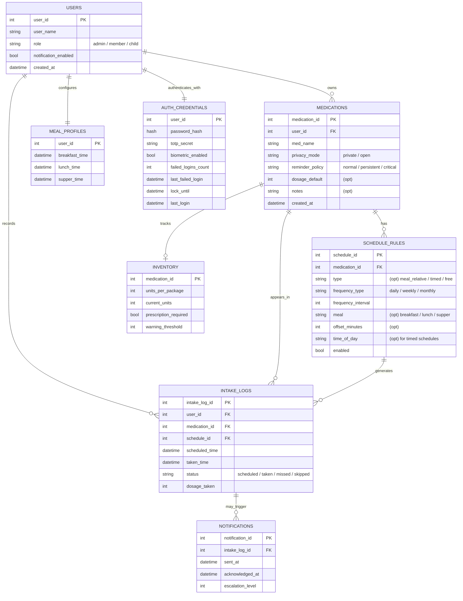
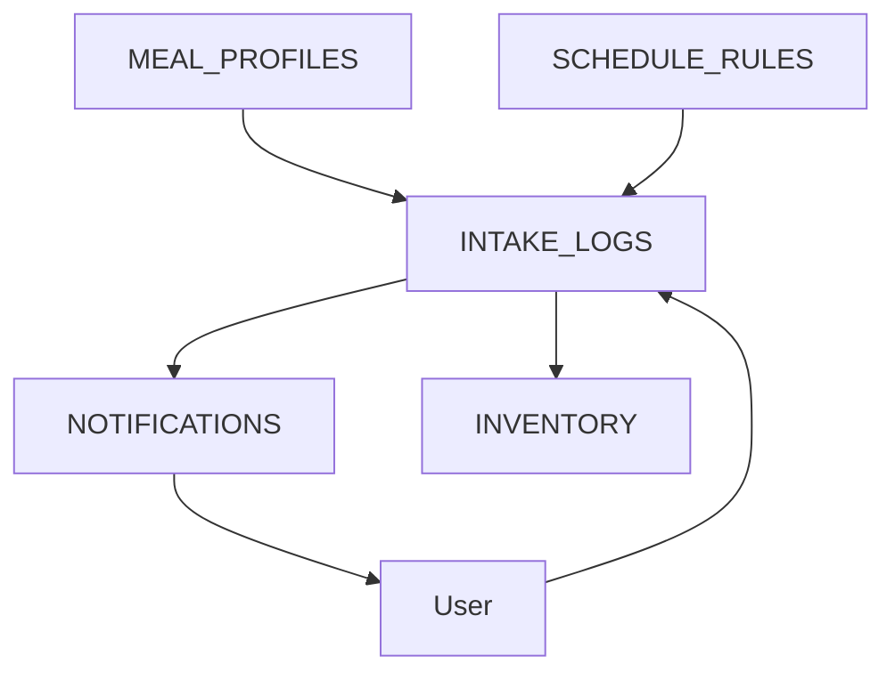
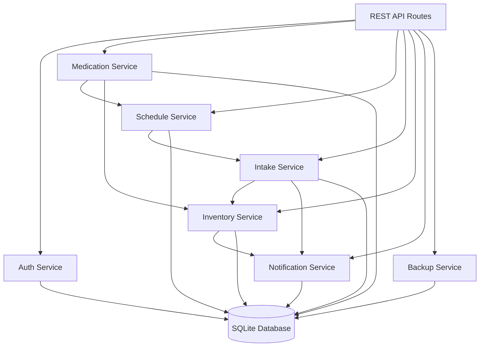

# Software Design Document

The Software Design Document describes the MVP architecture, while also noting some of the future extension. The MVP target is single-user operation.

Multi-user operation, household/parental mode, Android app and Home Assistant integration are future goals unless explicitly pulled into a later milestone.

#### Table of Contents

- [System architecture](#system-architecture)
- [Data design](#data-design)
- [Interface design](#interface-design)
- [Component design](#component-design)
- [User interface design](#ui-design)
- [Assumptions and dependencies](#assumptions-dependencies)

---

<a name="system-architecture"></a>

## System architecture

<!--
A high-level diagram of the architecture
Description of major components and what they do
Explanation of design patterns and architectural styles used
Discussion of important design decisions and trade-offs
-->



#### Frontend (React-based)

- Render application state received from the backend
- Provide medication, schedule and inventory management screens
- Provide daily intake overview
- Allow users to acknowledge or skip reminders
- Display privacy-aware browser / UI notifications
- Validate user input for usability purposes

The frontend must not be treated as trusted. All relevant authorization and business rules are enforced by the backend.

#### Backend (Node.js exposing a REST API)

- Own all business logic
- Validate API requests
- Manage authentication and sessions
- Manage medications, schedules, inventory and intake history
- Generate daily reminder / intake states
- Trigger reminder escalation behavior
- Handle backup creation and restore workflows
- Communicate with the SQLite database

The backend is the source of truth for application state.

#### Database / local persistence layer (SQLite)

- Store users
- Store medication definitions
- Store schedule rules
- Store inventory state
- Store intake history
- Store backup metadata if required

Clients never access SQLite directly. All access goes through the backend.

#### Backups

- Handled by the backend
- Create encrypted database backups
- Create encrypted configuration backups if required
- Store backups in a mounted backup directory
- Allow restore workflows through the web interface in the future

Backup encryption keys must not be stored inside the backup directory.

#### Authentication

MVP authentication uses single-user login with server-managed sessions.

Sessions are stored server-side and transmitted via secure cookies when HTTPS is available.

Future authentication extensions may include TOTP and Android biometric unlock. Biometric unlock is treated as a client-side convenience and does not replace backend session authentication.

---

<a name="data-design"></a>

## Data design

<!--
Database structure and table layouts
Data flow diagrams
Data validation and integrity rules
How data will be stored and retrieved
-->

Condensed:



<details>
<summary>Extensive data models and relationships</summary>



</details>

This user story demonstrates how the data model interacts during a typical medication intake workflow.

<details>
<summary>User Story: Daily Vitamin D intake</summary>

### Scenario

The user has configured Vitamin D (`MEDICATIONS:med_name`) to be taken every day (`SCHEDULE_RULES:frequency_type`) 15 minutes before (`SCHEDULE_RULES:offset_minutes`) breakfast (`SCHEDULE_RULES:meal`).

Breakfast is configured for 08:00 (`MEAL_PROFILES:breakfast_time`), resulting in a scheduled intake time of 07:45.

The medication uses the 'normal' reminder policy (`MEDICATIONS:reminder_policy`).

### Expected Flow

1. The scheduler generates the next intake event from the meal profile and schedule rule.
2. An intake log entry is generated for 07:45 (`INTAKE_LOGS:scheduled_time`).
3. A browser notification is sent (`NOTIFICATIONS`).
4. The user marks the medication as taken.
5. The intake log is updated and the notification is acknowledged (`NOTIFICATIONS:acknowledged_at && INTAKE_LOGS:taken_time`).
6. Inventory is decremented by one tablet (`INVENTORY:current_units`).

### Data Flow



### Database State

Before:

- `INVENTORY.current_units = 42`
- `INTAKE_LOGS.status = scheduled`

After:

- `INVENTORY.current_units = 41`
- `INTAKE_LOGS.status = taken`
- `NOTIFICATIONS.acknowledged_at != null`
- `INTAKE_LOGS.taken_time != null`
</details>

---

<a name="interface-design"></a>

## Interface design

<!--
API specifications and protocols
Message formats and data structures
How errors and exceptions will be handled
Security and authentication methods
-->

PillTracker exposes a REST-style HTTP API used by the React web interface and future clients such as Android and Home Assistant.
All clients communicate with the backend through the API. Clients do not access the database directly.

### API Style

- REST-style HTTP API
- JSON request and response bodies
- Backend-owned validation and business logic
- Session-based authentication for the web interface
- Future token-based authentication may be added for external integrations

#### API Areas

Planned API areas:

- Authentication
- Users
- Medications
- Schedule rules
- Intake logs
- Inventory
- Notifications
- Backups
- Settings

#### Example Endpoints

```text
POST /api/auth/login
POST /api/auth/logout
GET  /api/session

GET    /api/medications
POST   /api/medications
GET    /api/medications/:id
PATCH  /api/medications/:id
DELETE /api/medications/:id

GET  /api/today
POST /api/intakes/:id/taken
POST /api/intakes/:id/skipped

GET  /api/inventory
PATCH /api/inventory/:medicationId

POST /api/backups
GET  /api/backups
POST /api/backups/:id/restore
```

### Message Format

Requests and responses use JSON.

Example medication response:

```json
{
  "id": 1,
  "name": "Vitamin D",
  "privacyMode": "open",
  "reminderPolicy": "normal",
  "inventory": {
    "currentUnits": 42,
    "warningThreshold": 10
  }
}
```

### Error Handling

Errors use a consistent JSON format.

```json
{
  "error": {
    "code": "VALIDATION_ERROR",
    "message": "Medication name is required"
  }
}
```

Common HTTP status codes:

```text
400  Bad Request       invalid request data
401  Unauthorized      user is not authenticated
403  Forbidden         user is authenticated but not allowed
404  Not Found         resource does not exist
409  Conflict          request conflicts with current state
500  Server Error      unexpected backend error
```

### Authentication

The web interface uses server-managed sessions. The frontend must not store sensitive authentication secrets directly. Future Android and Home Assistant integrations may use separate token-based authentication.

#### Security Notes

- All validation is enforced by the backend.
- Clients are not trusted.
- Medication privacy settings are applied by the backend before responses are sent.
- HTTPS is strongly recommended for all non-local deployments.

---

<a name="component-design"></a>

## Component design

<!--
Purpose and responsibilities
Input and output specifications
Algorithms and processing logic
Dependencies on other components or external systems
-->

The backend is split into logical service components. Each component owns one part of the business logic and communicates with other components through explicit service calls.

The goal is to avoid placing business logic directly inside API route handlers or frontend code.



| Component            | Owns                                     | Main dependencies                 |
| -------------------- | ---------------------------------------- | --------------------------------- |
| Auth Service         | Login, sessions, future TOTP             | `USERS`, `AUTH_CREDENTIALS`       |
| Medication Service   | Medication definitions and privacy rules | `MEDICATIONS`, `USERS`            |
| Schedule Service     | Schedule rules and planned intake times  | `SCHEDULE_RULES`, `MEAL_PROFILES` |
| Intake Service       | Intake generation and state changes      | `INTAKE_LOGS`, `SCHEDULE_RULES`   |
| Inventory Service    | Stock changes and low-stock warnings     | `INVENTORY`, `MEDICATIONS`        |
| Notification Service | Reminder payloads and acknowledgement    | `NOTIFICATIONS`, `INTAKE_LOGS`    |
| Backup Service       | Encrypted backup/restore workflows       | SQLite file, backup volume        |

<details>
<summary>Auth Service</summary>

Purpose:

- Manage login and logout
- Validate active sessions
- Handle future TOTP support
- Track failed login attempts and lockout state

Input:

- Login credentials
- Session tokens/cookies
- User identifiers

Output:

- Authenticated session
- Authentication errors
- User identity for authorized requests

Dependencies:

- `AUTH_CREDENTIALS`
- `USERS`
</details>

<details> 
<summary>Medication Service</summary>

Purpose:

- Create, read, update and delete medication definitions
- Enforce medication ownership
- Apply medication privacy settings before data is returned to clients

Input:

- Medication form data
- User identity
- Medication identifier

Output:

- Medication records
- Validation errors

Dependencies:

- `MEDICATIONS`
- `USERS`
</details>

<details>
<summary>Schedule Service</summary>

Purpose:

- Manage medication schedule rules
- Calculate planned intake times from fixed times or meal-relative schedules
- Provide schedule data for the scheduler and daily overview

Input:

- Schedule rule data
- Meal profile data
- Medication identifier

Output:

- Schedule rules
- Calculated planned intake times

Dependencies:

- `SCHEDULE_RULES`
- `MEAL_PROFILES`
- `MEDICATIONS`
</details>

<details>
<summary>Intake Service</summary>

Purpose:

- Generate and update intake log entries
- Mark intakes as taken, skipped or missed
- Provide daily intake overview and history

Input:

- Schedule rules
- User actions
- Current time

Output:

- Intake logs
- Daily overview
- Intake history

Dependencies:

- `INTAKE_LOGS`
- `SCHEDULE_RULES`
- `MEDICATIONS`
</details>

<details>
<summary>Inventory Service</summary>

Purpose:

- Track current medication stock
- Decrement inventory after confirmed intake
- Detect low-stock conditions

Input:

- Medication identifier
- Dosage amount
- Inventory update data

Output:

- Updated inventory state
- Low-stock warnings

Dependencies:

- `INVENTORY`
- `INTAKE_LOGS`
- `MEDICATIONS`
</details>

<details>
<summary>Notification Service</summary>

Purpose:

- Create reminder notifications from intake logs
- Apply privacy settings before notification content is generated
- Track notification acknowledgement and escalation level

Input:

- Intake log entries
- Medication privacy settings
- Reminder policy

Output:

- Notification records
- Browser/UI notification payloads

Dependencies:

- `NOTIFICATIONS`
- `INTAKE_LOGS`
- `MEDICATIONS`
</details>

<details>
<summary>Backup Service</summary>

Purpose:

- Create encrypted backups
- Restore backups through controlled workflows
- Keep database backups separate from configuration and keys

Input:

- Backup request
- Database file
- Configuration data

Output:

- Encrypted backup file
- Restore status
- Backup metadata

Dependencies:

- SQLite database file
- Mounted backup directory
- External encryption tool/library
</details>

---

<a name="ui-design"></a>

## User interface design

<!--
Wireframes or mockups of key screens
Description of user workflows and interactions
Accessibility considerations
-->

### UI goals

- Fast daily intake confirmation from both notifications and landing page, simple enough for daily use without requiring detailed navigation
- Low friction handling for supplements and non-critical medication
- Strong visibility and escalation for critical medications
- Privacy-aware display of medication names and reminder content
- Usable on desktop and mobile (future extension) browsers

### Main screens

- Login screen
- Daily overview
- Intake history view
- Medication detail / editor
- Schedule editor
- Inventory overview
- Settings
- Household / parental overview (future extension)

### Key user interactions

- Add medication
- Edit medication details
- Configure schedule
- Confirm intake
- Skip intake
- Handle missed critical medication
- Update inventory manually
- Review intake history
- Adjust privacy and notification settings

### History visualization

The history view should provide a compact matrix-style overview inspired by GitHub contribution graphs.

Each cell represents an intake state for a specific day, medication or planned intake slot.

Suggested states:

- Green: all taken
- Yellow: skipped or delayed a medication
- Red: missed a non-critical medication
- Highlighted red / warning state: missed critical medication
- Grey: no planned intake or no data

(The final color keys are still up to debate.)

The matrix is intended as a quick pattern-recognition tool, not as the only history interface. Detailed intake records should remain available through day or medication selection.

### Wireframe approach

These wireframes are low-fidelity and used to define layout intent, not final visual design.

> [!NOTE]
>
> TODO: Create Figma wireframes for MVP screens
>
> - Login screen
> - Daily overview
> - Medication editor
> - Schedule editor
> - Inventory overview
> - History view
> - Settings screen

---

<a name="assumptions-dependencies"></a>

## Assumptions and dependencies

<!--
Technical assumptions about the development environment
Dependencies on external libraries or services
Constraints related to hardware, software, or infrastructure
Any regulatory or compliance requirements
-->

- **Frontend:** The frontend is based on React. The browser UI is the primary client for the MVP. Android and Home Assistant integrations are future projects.
- **API:** The backend exposes a REST-style HTTP API using JSON request and response bodies.
- **Backend:** The backend is based on Node.js. The exact API framework is not decided yet (most likely express for the MVP).
- **Persistence:** The primary local database is using SQLite.
- **Backups:** Backups must be encrypted. Backup encryption keys must not be stored inside the backup directory.
- **Deployment:** The application is designed for local-first, self-hosted deployment using Docker.
- **Transport security:** HTTPS is strongly recommended. Local HTTP may exist during development or limited local-only deployments.
- **Development environment:** Development is based on a VSCode devcontainer to keep tooling reproducible for possible contributors.
- **Scope limitation:** The SDD describes the MVP architecture and selected future extension points. Future extensions are not required for the first backend / API implementation unless explicitly pulled into a later issue.
- **Development scaling:** Development will start with a minimal operational foundation before implementing domain-specific features. The first goal is to prove that the backend, API, transport layer and frontend can interact meaningfully. This allows later features to be implemented and tested through realistic integration paths instead of isolated placeholder logic. Early foundation tests may be replaced or refactored as the real domain model becomes available. This approach keeps framework choices flexible after the MVP stack proved practical.
- **Contributing:** Contributions are welcome, especially in the form of pull requests or discussions and issue threads related to security, privacy, and secondarily architecture. Pull requests that replace the selected MVP stack or rewrite major parts of the project in a different framework or language are out of scope before MVP. Framework and language discussions with meaningfull argumentation will be collected for possible post-MVP reconsideration, but they should not block the MVP development.
