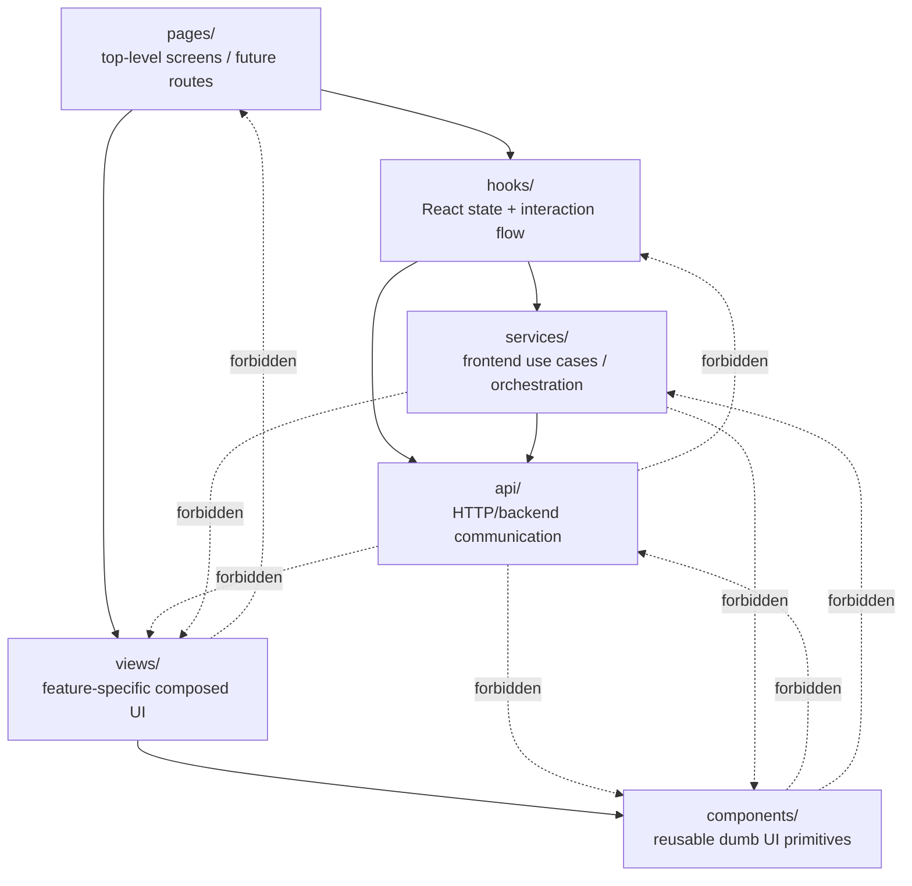

# Frontend architecture

## Purpose

This document defines the long-lived frontend architecture contract for PillTracker.

It describes layer ownership, dependency direction, state handling and boundaries between API
communication, application logic, feature views and reusable UI components.

This document does not describe the concrete implementation target for one milestone.
Milestone-specific frontend plans belong in milestone target documents, for example
`frontend/src/milestone1-target.md`.

## Design goals

The frontend architecture should be:

- easy to understand while working alone
- small enough to refactor without pain
- layered enough to avoid hidden spaghetti
- compatible with React web now
- friendly to possible React Native reuse later
- strict about ownership boundaries
- relaxed about unnecessary abstractions

The goal is to make every layer justify its existence and not to cosplay corporate architecture
boundries.

## Layer overview

Frontend code is split into these conceptual layers:

| Layer      | Function                                        |
| ---------- | ----------------------------------------------- |
| pages      | top-level app screens / future route boundaries |
| views      | feature-specific composed UI sections           |
| components | reusable dumb UI primitives                     |
| hooks      | React state and interaction flow                |
| services   | frontend use cases / orchestration              |
| api        | HTTP/backend communication                      |

Recommended folder shape:

```txt
frontend/src/
|- App.jsx
|- main.jsx
|- styles.css
|- api/
|- services/
|- hooks/
|- components/
|- views/
|- pages/
```

## Contract design



## Core dependency rules

- Higher layers may depend on lower layers.
- Lower layers must not depend on higher layers.
- A file may import from another layer only when the imported layer is below it or explicitly
  allowed by this architecture document.
- Every boundary should either transform, hide technical details, own state or provide a stable
  abstraction.
- Blind re-export is suspicious.

The normal data and control flow is:

```txt
user action
-> page/view
-> hook
-> service
-> api
-> backend
-> api
-> service
-> hook state update
-> page/view render
-> component render
```

Not every action needs every layer. Simple actions may skip a service if no use-case orchestration
is needed.

## Layer responsibilities

### `api/`

The API layer owns backend communication. The API layer should hide HTTP details from the rest of
the frontend.

It may know:

- endpoint paths
- HTTP methods
- request headers
- request body serialization
- response status handling
- JSON parsing
- low-level fetch errors
- backend response shapes

API helpers should provide stable functions for backend operations.

Examples:

```js
listDevNotes(storage);
getDevNote(storage, id);
createDevNote(storage, text);
updateDevNote(storage, id, text);
deleteDevNote(storage, id);
fetchHealthSummary();
fetchRuntimeHealth();
```

### `services/`

The service layer owns frontend use cases. A service may orchestrate multiple API calls or transform
backend data into frontend-friendly data.

Services may know:

- frontend use-case names
- API helper functions
- domain-level transformations
- dashboard models
- summary models
- fallback behavior

A service is justified when it gives meaning to raw API calls.

Good service examples:

```js
loadLandingDashboard();
appendAToLatestPersistentNote();
loadFullHealthReport();
executeDevNotesMethod(method, form);
```

Bad service example:

```js
export { fetchHealthSummary } from "../api/healthApi.js";
```

A service should not blindly re-export API behavior as if it were its own.

### `hooks/`

Hooks own React state and interaction flow.

Hooks may know:

- loading state
- error state
- selected storage target
- selected method
- form state
- expanded/collapsed state
- latest API response
- table rows
- refresh actions
- submit handlers

Hooks may call services.

Hooks may call API helpers directly when the action is simple and no meaningful service use case
exists.

Hooks should expose grouped state and actions to pages or views.

Example return shape:

```js
{
  state,
  form,
  data,
  status,
  actions,
}
```

Hooks should avoid returning large unstructured blobs.

If a hook becomes hard to read, split it by responsibility rather than hiding complexity in views.

### `pages/`

Pages are top-level app screens. A page is a future route boundary even if the current
implementation uses tabs or local page state.

Pages may:

- call feature hooks
- select which view to render
- connect hook state/actions to views
- provide top-level layout for one screen

Pages should not contain large feature layouts once those layouts grow.

Move feature-specific composed UI into `views/`.

Pages should not call API helpers directly unless the page is intentionally tiny and no hook/service
exists yet.

### `views/`

Views are feature-specific composed UI sections.

Views may know feature concepts such as:

- dev-notes
- health reports
- persistence status
- runtime status
- storage target
- method panel
- response viewer

Views may compose reusable components.

Views should receive data and callbacks through props.

Views should not fetch data directly.

Views should not import API helpers.

Views should not own major feature state. That belongs in hooks.

Small visual state is allowed when it is purely local and presentational.

Examples:

```txt
DevNotesCrudView
DevNotesMethodPanelView
DevNotesTableView
DevNotesResponseView
HealthSummaryView
HealthDetailView
LandingDashboardView
```

A view does not need to be reusable across the whole app.

A view is allowed to be domain-specific.

### `components/`

Components are reusable UI primitives.

Components may know visual concepts such as:

- card
- button
- tab
- status indicator
- JSON block
- table shell

Components should be dumb by default.

Components may receive data and callbacks through props.

Components must not import API helpers.

Components must not import services.

Components must not own feature workflows.

Components may have local state only when the state is purely visual, such as expanded/collapsed
display.

Examples:

```txt
Tabs
StatusCard
JsonBlock
ButtonRow
```

If a component starts knowing about dev-notes CRUD behavior or health endpoint behavior, it probably
belongs in `views/`.

## Export boundary rule

A layer may import from a lower layer, but it should not blindly re-export lower-layer data or
behavior as if it were its own.

Every boundary should do at least one of these:

- transform backend data into frontend-friendly data
- hide transport details
- provide a stable interface
- name a frontend use case
- own state
- enforce dependency direction
- reduce what higher layers need to know

Blind re-export is suspicious.

Pass-through is allowed when it creates a stable boundary. Pass-through is suspicious when it only
forwards the same parameters and return value without changing meaning, hiding details, owning state
or creating a useful seam.

The problem is not that data passes through layers. The problem is when nobody can explain why the
layer exists.

## Transformation rule

Layer boundaries should usually transform something.

Examples:

API response:

```js
{
  status: "healthy",
  checks: {
    runtime: { status: "healthy" },
    persistence: { status: "healthy" },
    devNotes: { status: "healthy", enabled: true },
  },
}
```

Service-level frontend model:

```js
{
  cards: [
    { id: "runtime", label: "Runtime", status: "healthy" },
    { id: "persistence", label: "Persistence", status: "healthy" },
    { id: "devNotes", label: "DevNotes", status: "healthy" },
  ],
  raw: healthSummary,
}
```

Hook state:

```js
{
  isLoading,
  error,
  dashboard,
  refresh,
}
```

View props:

```jsx
<HealthSummaryView cards={dashboard.cards} />
```

Component props:

```jsx
<StatusCard label="Runtime" status="healthy" />
```

Each layer reduces or reshapes what the next layer needs to understand.

## React state model

React state is the source of truth for UI state. UI should be rendered as a projection of state.
Local UI state should live at the lowest reasonable owner.

State ownership order:

1. purely visual local state: component or view
2. feature interaction state: hook
3. loaded backend data: hook, usually via service/API
4. shared app-wide state: only introduce later if needed

For M1, prefer:

```txt
useState
useEffect
custom hooks
plain service functions
plain API functions
```

Avoid global state until repeated state movement becomes a real problem.

## Side effects and lifetime

React-owned state is cleaned up when the owning component tree unmounts. External resources still
need explicit cleanup.

Examples of external resources:

- timers
- intervals
- event listeners
- WebSocket connections
- subscriptions
- animation frames
- abortable fetch requests
- third-party widgets

External resources should be managed through `useEffect` cleanup or a dedicated custom hook.

Example:

```js
useEffect(() => {
  const controller = new AbortController();

  fetch("/api/health", { signal: controller.signal });

  return () => {
    controller.abort();
  };
}, []);
```

## Classes

Classes are allowed, but they are not the default frontend pattern. Use a class only when the object
has meaningful identity, lifetime, configuration or resource ownership.

Possible class use cases:

- API client instance with base URL/config
- WebSocket connection wrapper
- timer/animation controller
- long-lived cache object
- platform adapter

Do not create classes only because a file contains multiple functions. Do not store React UI state
inside ordinary service classes unless the class is intentionally bridged into React state. React UI
state should normally live in hooks.

## Error handling

The API layer should detect low-level request/response failures.

Services may translate those failures into use-case-level results.

Hooks should store errors in state.

Views and components should display errors.

Avoid throwing raw errors directly into JSX. Development/debug views may show raw JSON responses.
Production/user-facing views should later normalize and sanitize error messages.

## Architecture maps

Frontend architecture may use Mermaid diagrams for two different purposes.

### Dependency maps

Dependency maps show imports and ownership direction. They answer:

```txt
Which files are allowed to know which files?
```

Dependency maps may be generated automatically from imports and may later be used in CI.

### Interaction maps

Interaction maps show runtime intent. They answer:

```txt
How does this user action move through pages, hooks, services, APIs and backend endpoints?
```

Interaction maps may be manually curated. They should show meaningful flow only. They should not
include every tiny helper, setter or JSX component unless that element is important for
understanding the feature. Concrete interaction maps belong in milestone target documents, not in
this long-lived architecture contract.

## Import enforcement

Import checks may be added later as a soft CI guard.

Useful rules:

```txt
api/ must not import React.
api/ must not import hooks/, views/, pages/ or components/.
services/ must not import React components.
services/ must not import views/ or pages/.
components/ must not import api/ or services/.
views/ must not import api/.
views/ must not import pages/.
pages/ may import hooks and views.
hooks may import services and api.
services may import api.
```

> [!NOTE]
>
> Early enforcement should warn before it blocks. Once the frontend structure stabilizes, these
> checks may become hard CI failures.

## Naming rules

Use names that show the file’s responsibility.

Recommended suffixes:

```txt
Page       = top-level screen
View       = feature-specific composed UI section
Api        = backend communication file
Service    = frontend use-case orchestration
use...     = React hook
```

Examples:

```txt
DevNotesCrudPage.jsx
DevNotesTableView.jsx
devNotesApi.js
devNotesService.js
useDevNotesCrud.js
```

Avoid vague names such as:

```txt
utils.js
helpers.js
data.js
manager.js
stuff.js
```

If a helper file is needed, name it after what it owns.

## Refactor triggers

Refactor when one of these happens:

- a page contains large mixed JSX and logic
- a component imports API helpers
- a component imports services
- two pages duplicate the same async state logic
- a view starts managing complex feature state
- a hook return object becomes hard to understand
- the same prop is passed through several layers unchanged
- a service only re-exports API behavior without adding meaning
- a file name no longer describes what the file does
- a layer starts depending upward

Do not refactor because the architecture diagram looks imperfect. Refactor because the current code
is becoming harder to change safely.

## M1 frontend constraints

M1 frontend code should stay deliberately small.

Allowed:

- tab-like page selection
- landing dashboard
- dev-notes CRUD playground
- health reporting view
- modest styling
- local React state
- custom hooks
- API helpers
- simple service transformations

Avoid in M1:

- global state library
- complex router unless needed
- authentication UI
- medication-domain UI
- offline cache
- optimistic update system
- React Native abstraction layer
- generic framework architecture

M1 should prove the vertical slice, not solve every future UI problem.

## Accountability checklist

Before adding new frontend code, ask:

1. Is this backend communication? Put it in `api/`.
2. Is this a named frontend use case? Put it in `services/`.
3. Is this React state or interaction flow? Put it in a hook.
4. Is this a top-level screen? Put it in `pages/`.
5. Is this feature-specific composed UI? Put it in `views/`.
6. Is this reusable visual UI? Put it in `components/`.
7. Is this file only forwarding parameters? Explain the boundary or remove it.
8. Is this abstraction reducing knowledge or just making the call stack taller?
9. Is this state owned by the lowest reasonable layer?
10. Would this import direction still make sense in a larger app?

The preferred architecture is not the most layered one. The preferred architecture is the one where
each layer has a reason to exist.
