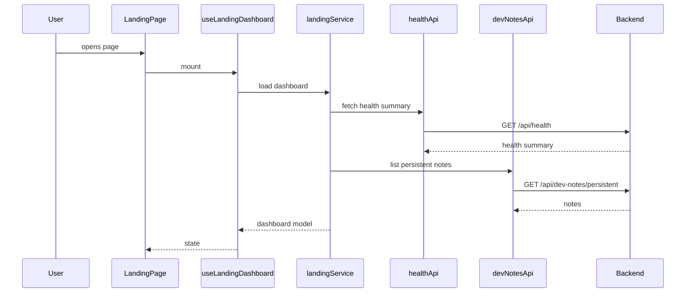

### Possible sequence

Reference:

```mermaid
sequenceDiagram
  participant User
  participant LandingPage
  participant useLandingDashboard
  participant landingService
  participant healthApi
  participant devNotesApi
  participant Backend

  User->>LandingPage: opens page
  LandingPage->>useLandingDashboard: mount
  useLandingDashboard->>landingService: load dashboard
  landingService->>healthApi: fetch health summary
  healthApi->>Backend: GET /api/health
  Backend-->>healthApi: health summary
  landingService->>devNotesApi: list persistent notes
  devNotesApi->>Backend: GET /api/dev-notes/persistent
  Backend-->>devNotesApi: notes
  landingService-->>useLandingDashboard: dashboard model
  useLandingDashboard-->>LandingPage: state
```
