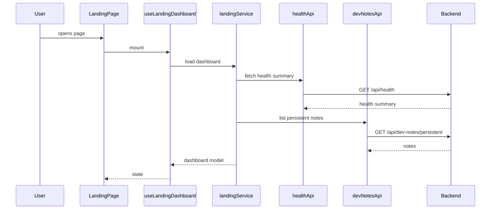
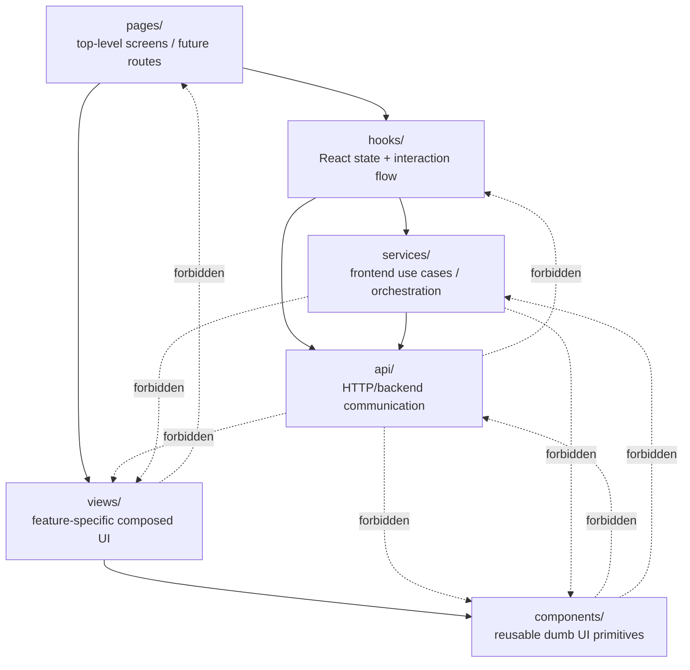

### Possible sequence

Reference:

### Contract design

- Higher layers may depend on lower layers.
- Lower layers must not depend on higher layers.
- Every boundary should either transform, hide technical details, own state or provide a stable
  abstraction.
- Blind re-export is suspicious.
