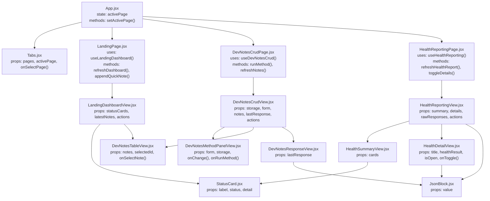
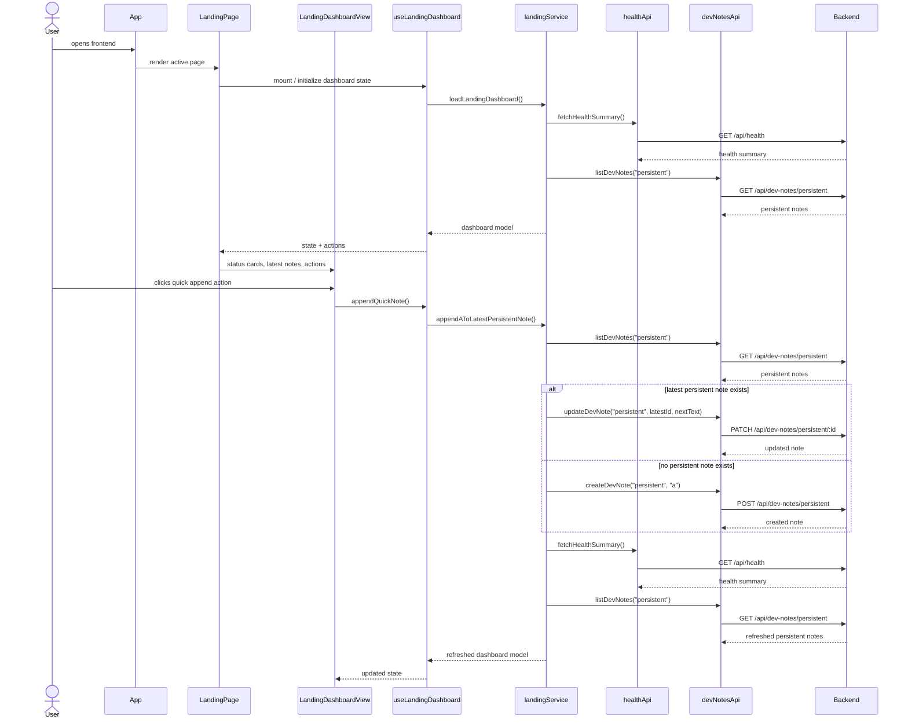
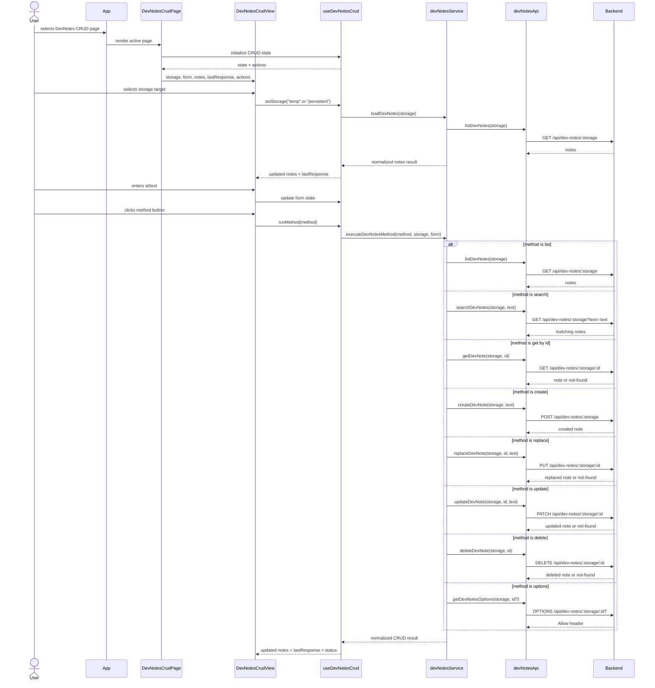
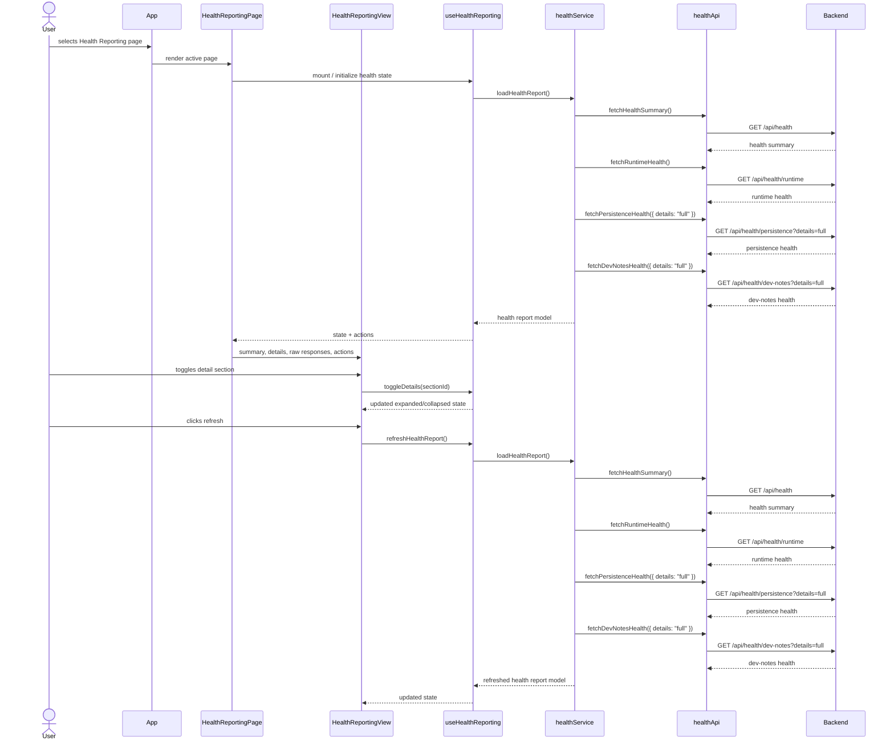

# Milestone 1 Frontend Target State

## Frontend component inventory

### App shell

| Component    | Purpose                                    |
| ------------ | ------------------------------------------ |
| `App`        | Owns active page selection and app shell.  |
| `Tabs`       | Renders page navigation.                   |
| `PageHeader` | Displays page title and short description. |

### Layout

| Component | Purpose                         |
| --------- | ------------------------------- |
| `Card`    | Reusable visual card container. |
| `Section` | Groups related content.         |
| `Toolbar` | Horizontal action area.         |

### Feedback

| Component      | Purpose                                |
| -------------- | -------------------------------------- |
| `StatusCard`   | Displays one subsystem status.         |
| `JsonBlock`    | Displays raw JSON responses.           |
| `ErrorBox`     | Displays request or validation errors. |
| `LoadingBlock` | Displays loading state.                |
| `EmptyState`   | Displays empty result state.           |

### Feature views

| View                   | Purpose                                                           |
| ---------------------- | ----------------------------------------------------------------- |
| `LandingDashboardView` | Composes dashboard cards and latest persistent notes.             |
| `DevNotesCrudView`     | Composes storage selector, method panel, table and response view. |
| `HealthReportingView`  | Composes health summary cards and detailed JSON sections.         |

## View structure

## Milestone 1 - Architecture

### Landing Page Sequence

### Dev-Notes CRUD Page Sequence

### Health Reporting Page sequence

